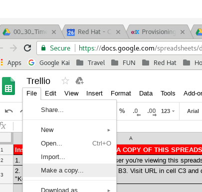
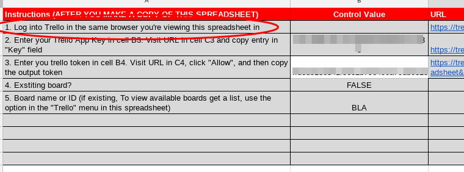
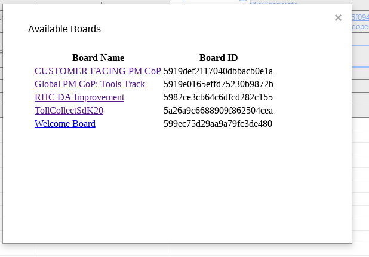
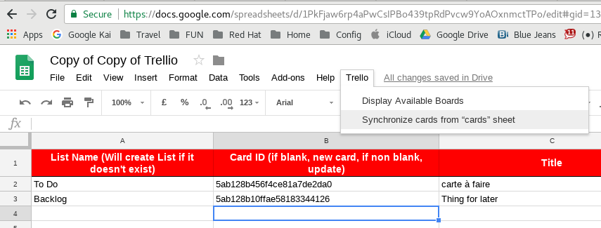
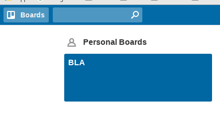

trellio Handout

Intention of this documentation is to give a brief insight in the
functionality and the usage concept of the trellio tool. trellio is a
helping tool to synchronize your Trello board with a local copy in a
google spreadsheet. This will make your life easier when you plan fast
and numerous updates on a board - Maybe in your sprint planning session.

[Starting point](#h.s77nnrbswgi)        [1](#h.s77nnrbswgi)

[Concept of the source
spreadsheet](#h.4p4alig3slsb)        [1](#h.4p4alig3slsb)

[Connect the spreadsheet with the right Trello
board](#h.b2m51vydbkcf)        [2](#h.b2m51vydbkcf)

[Step 1 - Connect to your Trello
account](#h.j85njjwfjxgi)        [3](#h.j85njjwfjxgi)

[Step 2 - Authorize application to connect to
Trello](#h.qm0p161abk2r)        [3](#h.qm0p161abk2r)

[Step 3 - Authorize application
access](#h.hy6t9bcm5udm)        [4](#h.hy6t9bcm5udm)

[Step 4 - Identify the board you would like to
use](#h.v82r0d2wr3p0)        [4](#h.v82r0d2wr3p0)

[Use an existing board](#h.f9r0cy1mzn15)        [4](#h.f9r0cy1mzn15)

[Create a new board](#h.p25ru7pcf2w4)        [5](#h.p25ru7pcf2w4)

[Step 5 - Synchronize](#h.muu0g9suw0pp)        [6](#h.muu0g9suw0pp)

[Concept of the cards
sheet](#h.b7znbhjyje2w)        [6](#h.b7znbhjyje2w)

[Best Practice](#h.sbzmoy5e42h)        [7](#h.sbzmoy5e42h)

[Disclaimer](#h.52qupbkczxy)        [7](#h.52qupbkczxy)

Starting point {#h.s77nnrbswgi .c5}
==============

The source of the spreadsheet is here.

[https://docs.google.com/spreadsheets/d/1I4PFhhuACznfvmt7QqU9tRPUZGlAVwerztUQYscbf4s/edit\#gid=0](https://www.google.com/url?q=https://docs.google.com/spreadsheets/d/1I4PFhhuACznfvmt7QqU9tRPUZGlAVwerztUQYscbf4s/edit%23gid%3D0&sa=D&ust=1524750230808000)

Concept of the source spreadsheet {#h.4p4alig3slsb .c17}
-------------------------------------------------------

Keep in mind that you now have access to a read only source
file^[[a]](#cmnt1)^. This concept has the following impact on your next
steps:

1.  You need to make a copy of this spreadsheet in order to use it AND
    to participate from the latest changes made to the
    trellio functionalities.
2.  Whenever you want to benefit from latest improvements make sure to
    use the latest version of the source spreadsheet. [[-\> Staring
    point]](#h.s77nnrbswgi)

And store “your” copy in the folder of your choice.

Connect the spreadsheet with the right Trello board {#h.b2m51vydbkcf .c17}
--------------------------------------------------------------------------

Once you open the spreadsheet the first time you find two sheets in it

-   Sheet “Config”

-   Do what is documented in step 1 of the spreadsheet to connect
    Trello with your spreadsheet - the trellio script will do the
    needful

-   Sheet “cards”

### Step 1 - Connect to your Trello account {#h.j85njjwfjxgi .c8}

If not existing up now your API ID will be generated. Once done the ID
will be displayed and to be transferred to the
spreadsheet.

Use the link in the spreadsheet itself - they script behind the link
will do the work for you.

### Step 2 - Authorize application to connect to Trello {#h.qm0p161abk2r .c8}

By clicking the link - as before the script in the background will do
the work - the personal API key will be displayed. Transfer this key to
the column “B”.

### Step 3 - Authorize application access {#h.hy6t9bcm5udm .c8}

You now need to authorize the app to interact with Google spreadsheet.
You do this by - again - using the link in the spreadsheet. This will
link you to the Trello page to authorize the app.

We suggest to press “Allow” ….. This is written here as you never know
…..

The key presented to you needs to be transfered to the spreadsheet.

### Step 4 - Identify the board you would like to use {#h.v82r0d2wr3p0 .c8}

#### Use an existing board {#h.f9r0cy1mzn15 .c16}

You can use existing boards by using the trellio scripts. The response
will be a list of available Trello boards. Just choose the ID of  the
board you would like to use.

By using the ID you will be able to have multiple boards with the same
name.

Transfer the ID to the Config sheet and you are Done

#### Create a new board {#h.p25ru7pcf2w4 .c16}

In order to create a new board, just use the Config sheet as below. By
synchronizing [[ -\> Synchronize ]](#h.muu0g9suw0pp) the first time all
information and input you did to the sheet will be transferred. You are
done.

### Step 5 - Synchronize {#h.muu0g9suw0pp .c8}

Now - once configured all the details give it a try and synchronize.

And the information will be transferred ……

Concept of the cards sheet {#h.b7znbhjyje2w .c5}
==========================

There is a hidden column “B” which is currently filled with some default
data. So a [[ -\> Synchronize ]](#h.muu0g9suw0pp)^[[b]](#cmnt2)^would
fail as the script would look for cards with the mentioned IDs in column
“B”

-   An empty list in sheet “cards” will be filled with content from the
    Trello board.
-   Cards NOT existing in the trello board but in the spreadsheet will
    be created.
-   Cards EXISTING in the Trello board AND in the spreadsheet will be
    overwritten with the spreadsheet’s content - !! Be careful here”

Best Practice {#h.sbzmoy5e42h .c17}
-------------

In order to be sure not to lose informations other Trello board users
added in the meantime since your last [[ -\> Synchronize
]](#h.muu0g9suw0pp) the common way should be

1.  Use your spreadsheet with the information in the sheet Config as a
    skeleton
2.  Empty all entries in the sheet “cards”
3.  Execute the [[ -\> Synchronize ]](#h.muu0g9suw0pp)  now - This will
    lead to a fresh and updated list of cards+
4.  Inform other Trello boards users about the work in order to minimize
    loss of information when you [[ -\> Synchronize ]](#h.muu0g9suw0pp) 
5.  Make your changes
6.  [[ -\> Synchronize ]](#h.muu0g9suw0pp)  asap!
7.  Done - Congratulations

Disclaimer {#h.52qupbkczxy .c5}
==========

Do not share sensitive and personal information in the sheet. Keep in
mind that the API details are sensitive information you definitely do
NOT want to be shared!

[[a]](#cmnt_ref1)Hi Romain - Is it readonly now?

[[b]](#cmnt_ref2)Create a section sync and refer to it here

